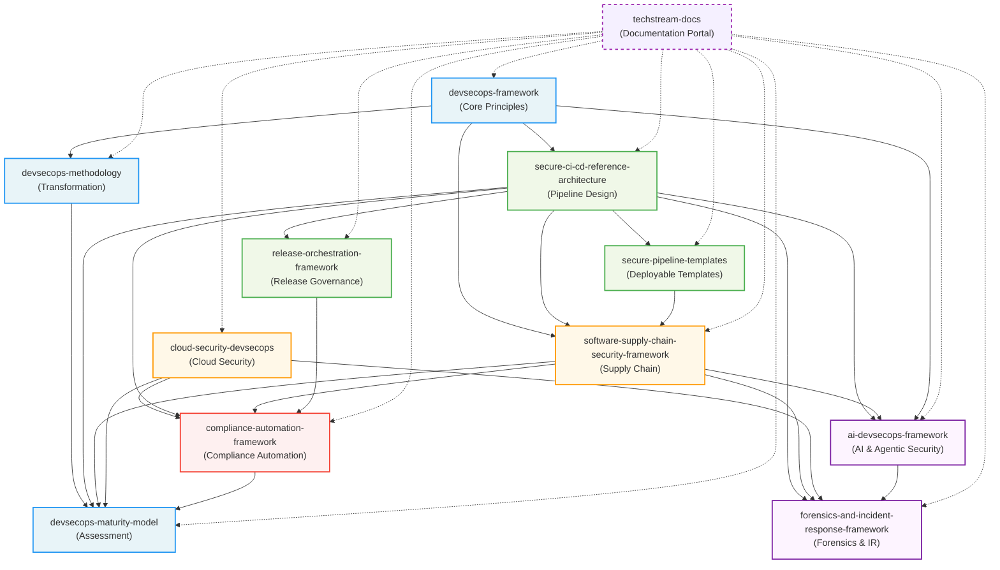

<p align="center">
  <a href="https://techstream.app">
    
  </a>
</p>

# Techstream Official Documentation Portal

> The central reference for Techstream's DevSecOps frameworks, methodologies, and implementation guidance.

---

## About Techstream

Techstream is a DevSecOps engineering and advisory organization dedicated to helping software organizations deliver secure software at the speed that modern business demands. Techstream develops and maintains a suite of open-source frameworks, reference architectures, and implementation guides that enable engineering teams to integrate security deeply into their development, delivery, and operations practices—without sacrificing velocity.

This documentation portal is the authoritative entry point for all Techstream frameworks and resources. Whether you are starting a DevSecOps journey from scratch, seeking to mature an existing security program, or looking for specific technical implementation guidance, this portal will direct you to the right resource.

---

## Getting Started in 30 Minutes

If you are new to Techstream, the fastest path to value depends on your immediate goal:

**Goal: Secure a CI/CD pipeline right now**
1. Clone [secure-pipeline-templates](https://github.com/sotille/secure-pipeline-templates) and deploy the GitHub Actions, GitLab CI, or Jenkins template for your platform
2. Review the [Pipeline Security Hardening Checklist](https://github.com/sotille/secure-pipeline-templates/blob/main/docs/hardening-checklist.md) against your current pipeline
3. Read the [Secure CI/CD Reference Architecture](https://github.com/sotille/secure-ci-cd-reference-architecture) to understand the architectural decisions behind the templates

**Goal: Assess where your organization stands**
1. Run the [DevSecOps Maturity Assessment Scorecard](https://github.com/sotille/devsecops-maturity-model/blob/main/docs/assessment-scorecard.md) with a cross-functional team (2–4 hours)
2. Map your lowest-scoring domains to frameworks using the [Framework Selection Guide](docs/framework-selection-guide.md)
3. Use the [18-Month Roadmap](https://github.com/sotille/devsecops-framework/blob/main/docs/roadmap.md) to plan your improvement program

**Goal: Prepare for a compliance audit (SOC 2, PCI-DSS, ISO 27001)**
1. Start with the [Compliance Automation Framework](https://github.com/sotille/compliance-automation-framework) and its [Regulatory Controls Matrix](https://github.com/sotille/compliance-automation-framework/blob/main/docs/regulatory-controls-matrix.md)
2. Review [Integration Scenario 2](docs/integration-scenarios.md#scenario-2-soc-2-type-ii-audit-preparation-through-devsecops-automation) for the SOC 2 automation walkthrough
3. If you operate across multiple jurisdictions, read the [Geographic Compliance Guide](https://github.com/sotille/compliance-automation-framework/blob/main/docs/geographic-compliance.md)

**Goal: Respond to a supply chain security concern**
1. Read the [Software Supply Chain Security Framework](https://github.com/sotille/software-supply-chain-security-framework) introduction and architecture
2. Use the [Supply Chain Incident Response Playbook](https://github.com/sotille/software-supply-chain-security-framework/blob/main/docs/incident-response-playbook.md) for immediate response steps
3. Use the [SBOM Guide](https://github.com/sotille/software-supply-chain-security-framework/blob/main/docs/sbom-guide.md) to establish SBOM generation and fleet querying

Not sure where to start? Use the [Framework Selection Guide](docs/framework-selection-guide.md) with its decision tree to find your entry point.

---

## What Techstream Does

Techstream operates at the intersection of security engineering and software delivery. Our work spans three primary areas:

**Framework Development**: We develop and maintain open-source frameworks that encode security best practices as structured, implementable guidance. These frameworks distill lessons from hundreds of real-world implementations into reusable patterns that any engineering organization can adopt.

**Advisory and Implementation**: We work directly with engineering organizations to assess their current state, design tailored DevSecOps programs, and implement the controls and tooling that close the gap between current and desired security posture.

**Community and Education**: We contribute to the broader DevSecOps community through open-source tooling, technical content, conference participation, and active engagement with industry standards bodies.

---

## Ecosystem Architecture

The Techstream ecosystem is organized into four layers. Understanding which layer to use for a given task prevents confusion between production guidance and learning material.

| Layer | Location | Purpose | Audience |
|-------|----------|---------|----------|
| **Layer 1 — Framework Repos** | This repository + 9 others | Enterprise reference documentation, architecture guidance, and technical depth | Engineering teams, architects, security engineers |
| **Layer 2 — Learning Companion** | [techstream-learn/](../techstream-learn/) | Hands-on labs and exercises — simplified, executable, < 60 min each | Practitioners learning the frameworks |
| **Layer 3 — Book Manuscripts** | [techstream-books/](../techstream-books/) | Five-volume book series: extended technical narrative with case studies | Readers of the Techstream book series |
| **Layer 4 — Enterprise Templates** | [techstream-enterprise/](../techstream-enterprise/) | Production-ready pipeline templates, compliance packs, IaC baselines | Teams in regulated or enterprise environments |

**Layer boundaries matter:**

- Layer 1 (this layer) contains the authoritative technical reference. It is the source of truth for all decisions, terminology, and architectural guidance.
- Layer 2 (techstream-learn) contains **learning-only** examples. Lab examples are simplified and intentionally not production-ready. Do not copy lab code into production.
- Layer 4 (techstream-enterprise) contains **production-ready** templates. Use these when you are ready to implement.
- Layers 3 and 4 are private repositories. Contact Techstream for access.

---

## Framework Repository Index

The following repositories comprise the Techstream Framework Suite:

| Repository | Description | Status |
|---|---|---|
| [devsecops-framework](https://github.com/sotille/devsecops-framework) | Core DevSecOps principles, practices, and organizational model | Active |
| [devsecops-methodology](https://github.com/sotille/devsecops-methodology) | Step-by-step methodology for DevSecOps transformation | Active |
| [devsecops-maturity-model](https://github.com/sotille/devsecops-maturity-model) | Maturity assessment model for DevSecOps programs | Active |
| [secure-ci-cd-reference-architecture](https://github.com/sotille/secure-ci-cd-reference-architecture) | Reference architecture for secure CI/CD pipelines | Active |
| [secure-pipeline-templates](https://github.com/sotille/secure-pipeline-templates) | Reusable pipeline templates for common security patterns | Active |
| [software-supply-chain-security-framework](https://github.com/sotille/software-supply-chain-security-framework) | Comprehensive guidance for software supply chain security | Active |
| [compliance-automation-framework](https://github.com/sotille/compliance-automation-framework) | Automated compliance controls and evidence collection | Active |
| [release-orchestration-framework](https://github.com/sotille/release-orchestration-framework) | Secure release management and deployment orchestration | Active |
| [cloud-security-devsecops](https://github.com/sotille/cloud-security-devsecops) | Cloud security integrated with DevSecOps practices | Active |
| [forensics-and-incident-response-framework](https://github.com/sotille/forensics-and-incident-response-framework) | Evidence preservation, compromise investigation, and agent forensics across pipeline, cloud, supply chain, and AI systems | Active |
| [ai-devsecops-framework](https://github.com/sotille/ai-devsecops-framework) | Security controls for AI-assisted development, agentic pipelines, and LLM systems in the software delivery lifecycle | Active |
| [techstream-docs](https://github.com/sotille/techstream-docs) | This documentation portal | Active |

---

## Framework Ecosystem Map

The following diagram shows how the ten Techstream frameworks relate to each other. Arrows indicate dependency or integration direction: a framework that depends on or integrates with another points toward it.



**Reading the diagram:**
- **Foundation layer** (blue): Start here when building a new program or beginning a transformation. These frameworks provide principles, methodology, and measurement.
- **Pipeline and delivery layer** (green): Use these frameworks to secure the software delivery pipeline. `secure-pipeline-templates` provides immediately deployable artifacts; the others provide architecture and governance guidance.
- **Domain security layer** (orange): Deep-dive frameworks for specific security domains — cloud infrastructure and software supply chain.
- **Compliance layer** (red): `compliance-automation-framework` is the evidence collection consumer of all other frameworks — it maps controls from every other framework to compliance requirements.
- **Cross-cutting layer** (purple): `forensics-and-incident-response-framework` and `ai-devsecops-framework` span all other layers. Forensics depends on evidence generated by every other framework; AI security extends pipeline, supply chain, and runtime security controls for AI/agentic systems.

---

## How to Navigate the Documentation

### By Role

**Engineering Leadership / Architects**
Start with [Introduction](docs/introduction.md) to understand the Techstream philosophy, then review [Architecture](docs/architecture.md) to understand how frameworks interconnect. Use [Roadmap](docs/roadmap.md) for program planning and investment guidance.

**Security Engineers**
Begin with [Framework](docs/framework.md) for the complete framework portfolio, then navigate to the specific framework repositories that address your immediate domain (e.g., [cloud-security-devsecops](https://github.com/sotille/cloud-security-devsecops) for cloud security, [software-supply-chain-security-framework](https://github.com/sotille/software-supply-chain-security-framework) for supply chain).

**Platform / DevOps Engineers**
Start with [secure-ci-cd-reference-architecture](https://github.com/sotille/secure-ci-cd-reference-architecture) and [secure-pipeline-templates](https://github.com/sotille/secure-pipeline-templates) for immediate, practical pipeline guidance. Reference [Architecture](docs/architecture.md) for system-level integration context.

**Development Teams**
Start with [devsecops-framework](https://github.com/sotille/devsecops-framework) for the foundational principles, then [secure-pipeline-templates](https://github.com/sotille/secure-pipeline-templates) for integration with your existing development workflows.

**Compliance / GRC Teams**
Focus on [compliance-automation-framework](https://github.com/sotille/compliance-automation-framework) and the compliance sections of [cloud-security-devsecops](https://github.com/sotille/cloud-security-devsecops). Use [devsecops-maturity-model](https://github.com/sotille/devsecops-maturity-model) for audit-ready maturity assessment.

### By Use Case

| Use Case | Start Here |
|---|---|
| Not sure where to start | [Framework Selection Guide](docs/framework-selection-guide.md) |
| Starting a DevSecOps program from scratch | [devsecops-methodology](https://github.com/sotille/devsecops-methodology) |
| Assessing current DevSecOps maturity | [devsecops-maturity-model](https://github.com/sotille/devsecops-maturity-model) |
| Securing CI/CD pipelines | [secure-ci-cd-reference-architecture](https://github.com/sotille/secure-ci-cd-reference-architecture) |
| Implementing cloud security controls | [cloud-security-devsecops](https://github.com/sotille/cloud-security-devsecops) |
| Automating compliance | [compliance-automation-framework](https://github.com/sotille/compliance-automation-framework) |
| Securing the software supply chain | [software-supply-chain-security-framework](https://github.com/sotille/software-supply-chain-security-framework) |
| Managing secure releases | [release-orchestration-framework](https://github.com/sotille/release-orchestration-framework) |
| Investigating a security incident (pipeline, cloud, supply chain) | [forensics-and-incident-response-framework](https://github.com/sotille/forensics-and-incident-response-framework) |
| Securing AI-assisted development or agentic pipelines | [ai-devsecops-framework](https://github.com/sotille/ai-devsecops-framework) |
| Coordinating incident response across frameworks | [Cross-Framework Incident Response](docs/cross-framework-incident-response.md) |
| Troubleshooting implementation issues | [Cross-Framework Troubleshooting Guide](docs/troubleshooting-guide.md) |
| Customizing frameworks for industry requirements | [Framework Customization Guide](docs/framework-customization-guide.md) |
| Understanding the full framework ecosystem | [Framework](docs/framework.md) (this portal) |

---

## Documentation Structure

```
techstream-docs/
├── README.md                         ← This file (portal entry point)
├── LICENSE                           ← Apache 2.0
└── docs/
    ├── introduction.md               ← About Techstream, mission, values, philosophy
    ├── architecture.md               ← Framework ecosystem map, integration patterns
    ├── framework.md                  ← Complete framework portfolio guide
    ├── framework-selection-guide.md  ← Decision tree, sequencing by org type, scope boundaries
    ├── integration-scenarios.md      ← Six end-to-end integration walkthroughs
    ├── troubleshooting-guide.md      ← Cross-framework troubleshooting: false positives, tool conflicts, integration issues
    ├── framework-customization-guide.md ← How to extend frameworks for industry-specific requirements (FSI, healthcare, government, SaaS)
    ├── implementation.md             ← Adoption guidance, engagement model
    ├── best-practices.md             ← Meta best practices for framework adoption
    └── roadmap.md                    ← Future roadmap, glossary, documentation index
```

---

## Learning Resources

The Techstream Book Series and hands-on lab companion provide a structured learning path through the full Techstream framework ecosystem.

- **[Book 1: DevSecOps — Foundations & Transformation](https://www.techstream.app/learn)** — Covers DevSecOps culture, the TDMM maturity model, and organizational transformation methodology.
- **[Book 2: Securing CI/CD & the Software Supply Chain](https://www.techstream.app/learn)** — Covers pipeline security, SLSA, SBOM, OIDC authentication, and software supply chain integrity.
- **[Book 3: Cloud-Native Security for DevSecOps](https://www.techstream.app/learn)** — Covers cloud security posture management, zero trust, CNAPP, and compliance automation.
- **[Book 4: Release Engineering & DevSecOps Governance](https://www.techstream.app/learn)** — Covers GitOps, progressive delivery, release governance, and DORA metrics.
- **[Book 5: AI and Agentic Systems Security for DevSecOps](https://www.techstream.app/learn)** — Covers AI threat modeling, prompt injection defense, agentic pipeline security, agent forensics, and the AI security maturity model. Companion to ai-devsecops-framework and forensics-and-incident-response-framework.
- **[Hands-On Labs (techstream-learn/)](https://www.techstream.app/learn)** — Practical lab exercises for all five volumes.
- **[Book Series Overview (VOLUMES.md)](../techstream-books/VOLUMES.md)** — Complete index and metadata for all five Techstream book volumes.
- **[Techstream Platform](https://www.techstream.app)** — The central portal for all Techstream frameworks, documentation, and learning resources.

---

## Contributing

Techstream frameworks are open-source and community contributions are welcome. To contribute:

1. Review the [Best Practices](docs/best-practices.md) guide for framework contribution guidelines
2. Open an issue describing the proposed change or addition before submitting a pull request
3. Ensure all contributions include appropriate documentation
4. Follow the established writing style: professional, precise, and free of marketing language
5. Include rationale for all recommendations — opinions without justification are not acceptable in Techstream frameworks

For significant contributions (new sections, new frameworks, architectural changes), engage with the Techstream community through the GitHub Discussions forum before investing significant effort.

---

## License

Copyright 2024 Techstream

Licensed under the Apache License, Version 2.0. See [LICENSE](LICENSE) for the full license text.

All Techstream framework repositories are licensed under the Apache License 2.0 unless explicitly noted otherwise.
