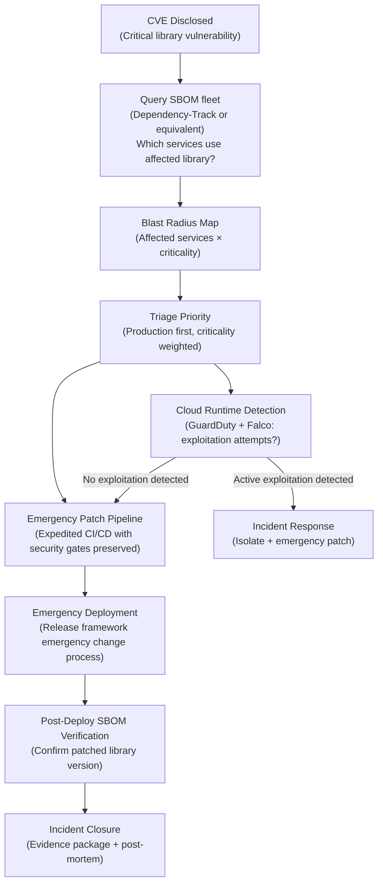

# Techstream Cross-Framework Integration Scenarios

## Overview

This document provides end-to-end integration scenarios showing how multiple Techstream frameworks combine to solve real-world organizational challenges. Each scenario describes a concrete situation, identifies the frameworks involved, explains the integration touchpoints, and provides implementation sequencing guidance.

These scenarios bridge the gap between individual framework documentation and the practical reality of running a DevSecOps program that spans multiple domains simultaneously.

---

## Table of Contents

- [Scenario 1: Startup Establishing a Security-First Pipeline From Day One](#scenario-1-startup-establishing-a-security-first-pipeline-from-day-one)
- [Scenario 2: SOC 2 Type II Audit Preparation Through DevSecOps Automation](#scenario-2-soc-2-type-ii-audit-preparation-through-devsecops-automation)
- [Scenario 3: Responding to a Software Supply Chain Incident](#scenario-3-responding-to-a-software-supply-chain-incident)
- [Scenario 4: Enterprise-Scale DevSecOps Transformation](#scenario-4-enterprise-scale-devsecops-transformation)
- [Scenario 5: Kubernetes Platform Security Hardening](#scenario-5-kubernetes-platform-security-hardening)
- [Scenario 6: Multi-Cloud Compliance Automation for a Financial Services Organization](#scenario-6-multi-cloud-compliance-automation-for-a-financial-services-organization)
- [Scenario 7: Internal Developer Platform Security Baseline](#scenario-7-internal-developer-platform-security-baseline)
- [Scenario 8: Securing an AI-Assisted DevSecOps Pipeline End-to-End](#scenario-8-securing-an-ai-assisted-devsecops-pipeline-end-to-end)
- [Framework Touchpoint Reference](#framework-touchpoint-reference)

---

## Scenario 1: Startup Establishing a Security-First Pipeline From Day One

### Situation

A 15-person software engineering team is building a SaaS product on AWS with Kubernetes. They are pre-Series A with no dedicated security staff. The CTO wants to establish secure practices before the codebase becomes large and complex. They have GitHub Actions as their CI/CD platform and need to ship fast without accumulating security debt.

### Frameworks Involved

- **devsecops-framework** — foundational principles and role model
- **secure-ci-cd-reference-architecture** — pipeline design decisions
- **secure-pipeline-templates** — immediately deployable pipeline security
- **cloud-security-devsecops** — AWS and Kubernetes security baseline
- **software-supply-chain-security-framework** — artifact signing and SBOM from the start

### Integration Flow

```
devsecops-framework
(principles alignment)
        │
        ├──► secure-ci-cd-reference-architecture
        │    (design the pipeline architecture)
        │           │
        │           ├──► secure-pipeline-templates
        │           │    (deploy GitHub Actions template immediately)
        │           │
        │           └──► software-supply-chain-security-framework
        │                (SBOM + Cosign signing from first build)
        │
        └──► cloud-security-devsecops
             (landing zone, IAM, Kubernetes hardening)
```

### Week-by-Week Integration Sequence

**Week 1–2: Pipeline Foundation**

Deploy the GitHub Actions secure pipeline template from `secure-pipeline-templates` as the starting point for all repositories. The template provides immediate coverage for SAST (Semgrep), SCA (Trivy), secret scanning (Gitleaks), and container image scanning with minimal configuration.

From `secure-ci-cd-reference-architecture`, apply the following immediately:
- Branch protection with required status checks on all repositories
- Pinning all GitHub Actions to commit SHAs (not mutable tags)
- Separate deployment permissions from build permissions (OIDC-based AWS access)

**Week 2–4: Cloud Security Baseline**

From `cloud-security-devsecops`, implement the minimum viable AWS security baseline:
- Enable CloudTrail logging to an S3 bucket with MFA delete
- Enable GuardDuty in all AWS regions
- Enable AWS Config with the CIS Benchmark rule pack
- Configure IAM roles with least-privilege for all CI/CD service accounts using OIDC federation (eliminates long-lived access keys)

**Month 2: Supply Chain Controls**

From `software-supply-chain-security-framework`, add to the pipeline:
- Cosign keyless signing for all container images using GitHub Actions OIDC
- Syft SBOM generation attached as a CycloneDX attestation
- Dependency pinning enforcement (exact versions in all package manifests)

**Month 3: Kubernetes Hardening**

From `cloud-security-devsecops`, apply Kubernetes security baseline:
- Deploy Kyverno admission controller with the policy library
- Enforce Pod Security Standards (restricted profile)
- Configure network policies with default-deny
- Deploy Falco for runtime security monitoring

### Key Integration Touchpoints

| Integration Point | From Framework | To Framework | What It Enables |
|---|---|---|---|
| OIDC pipeline identity | secure-ci-cd-reference-architecture | cloud-security-devsecops | Eliminates long-lived AWS credentials in CI |
| Cosign signing in pipeline | secure-pipeline-templates | software-supply-chain-security-framework | All artifacts signed from first build |
| Kyverno signature policy | cloud-security-devsecops | software-supply-chain-security-framework | Only signed images run in Kubernetes |
| GuardDuty + pipeline alerts | cloud-security-devsecops | secure-ci-cd-reference-architecture | Cloud threat detection correlated with deployments |

### Outcome

By month 3, a 15-person team has: secret scanning and SAST on every PR, dependency vulnerability scanning with break-build on Critical CVEs, signed artifacts with SBOMs, a hardened AWS landing zone with threat detection, and a Kubernetes cluster with admission control. No full-time security hire required — the frameworks provide the architectural guardrails that make security systematic rather than manual.

---

## Scenario 2: SOC 2 Type II Audit Preparation Through DevSecOps Automation

### Situation

A 200-person B2B SaaS company needs to achieve SOC 2 Type II certification within 12 months. They have existing CI/CD pipelines (mixed GitHub Actions and Jenkins), AWS infrastructure, and an Engineering team that is resource-constrained. The compliance team estimates that manual evidence collection would require one full-time equivalent for the audit period. The CTO wants to automate evidence collection so that the audit evidence is continuously generated as a pipeline output, not collected manually.

### Frameworks Involved

- **compliance-automation-framework** — SOC 2 control mapping and automated evidence collection
- **secure-ci-cd-reference-architecture** — pipeline as evidence generator
- **secure-pipeline-templates** — scan result artifacts as compliance evidence
- **cloud-security-devsecops** — AWS compliance controls and CSPM evidence
- **release-orchestration-framework** — change management evidence for CC8.1
- **devsecops-maturity-model** — baseline assessment to identify compliance gaps

### Integration Flow

```
devsecops-maturity-model
(baseline assessment → identify SOC 2 control gaps)
        │
        ▼
compliance-automation-framework
(map SOC 2 Trust Service Criteria to technical controls)
        │
        ├──► secure-ci-cd-reference-architecture + secure-pipeline-templates
        │    (CI/CD pipeline generates scan result evidence for CC7.1, CC7.2)
        │
        ├──► cloud-security-devsecops
        │    (AWS CSPM evidence for A1.1, A1.2, CC6.x availability/security)
        │
        └──► release-orchestration-framework
             (change management records for CC8.1 change control)
```

### Integration Sequence

**Month 1: Gap Assessment**

Run the TDMM assessment (`devsecops-maturity-model`) with a focus on the domains most relevant to SOC 2 Trust Service Criteria:
- CI/CD Security → CC7 (Change Management)
- Infrastructure Security → CC6 (Logical and Physical Access)
- Operations & Monitoring → CC7 (System Operations), A1 (Availability)
- Governance & Compliance → CC1 (Control Environment)

Map assessment gaps to specific SOC 2 Trust Service Criteria using the control mapping table in `compliance-automation-framework/docs/framework.md`.

**Month 2–3: Evidence Infrastructure**

From `compliance-automation-framework`, implement the evidence collection infrastructure:

```yaml
# Evidence collection pipeline stage (added to all CI pipelines)
- name: Collect Compliance Evidence
  run: |
    # Export SAST results as compliance artifact
    cp sast-results.sarif compliance-evidence/cc7.1-sast-$(date +%Y%m%d).sarif

    # Export dependency scan results
    cp sca-results.json compliance-evidence/cc7.1-sca-$(date +%Y%m%d).json

    # Upload to immutable evidence store
    aws s3 cp compliance-evidence/ \
      s3://soc2-evidence-bucket/ci-cd/$(date +%Y/%m/%d)/ \
      --recursive
```

Configure Prowler to generate AWS security findings in CIS Benchmark format, stored in the same evidence bucket with timestamps.

**Month 3–5: Release Evidence**

From `release-orchestration-framework`, implement the change management evidence trail required for SOC 2 CC8.1:
- All production deployments require a documented change request (PR-based approval workflow)
- Approval records include: who approved, when, what artifact was deployed, what tests passed
- Deployment records stored in the SOC 2 evidence bucket as structured JSON

**Month 5–6: Access and Configuration Evidence**

From `cloud-security-devsecops`, automate collection of:
- IAM permission reports (evidence for CC6.1, CC6.2)
- MFA enforcement status reports (CC6.1)
- VPC flow log analysis summaries (CC6.7)
- GuardDuty finding summaries (CC7.2)

**Month 6–12: Continuous Monitoring**

The evidence infrastructure now runs automatically. Monthly compliance posture reports are generated by Prowler. CI/CD scan results are automatically archived. Deployment records are automatically timestamped and stored. The audit evidence is current at all times, not collected in a pre-audit sprint.

### Key Integration Touchpoints

| SOC 2 Criterion | Evidence Source | Framework Providing Automation |
|---|---|---|
| CC7.1 (Vulnerability detection) | SAST/SCA scan results from CI/CD | secure-pipeline-templates → compliance-automation-framework |
| CC7.2 (Monitoring for anomalies) | GuardDuty + Prowler findings | cloud-security-devsecops → compliance-automation-framework |
| CC8.1 (Change management) | PR approval + deployment records | release-orchestration-framework → compliance-automation-framework |
| CC6.1 (Logical access) | IAM reports, MFA status | cloud-security-devsecops → compliance-automation-framework |
| A1.1 (Availability capacity) | AWS CloudWatch metrics | cloud-security-devsecops → compliance-automation-framework |

### Outcome

By audit time, the organization has 12 months of continuously generated, timestamped, immutably stored compliance evidence from automated sources. Auditor access is read-only to the evidence S3 bucket. Manual evidence collection is eliminated for the covered control areas. The SOC 2 compliance posture is visible in a real-time dashboard rather than being assessed once per year.

---

## Scenario 3: Responding to a Software Supply Chain Incident

### Situation

A critical CVE is disclosed in a widely-used parsing library (similar in scope to Log4Shell). The security team needs to answer within hours: which of our services use the affected library? Which versions? Which services are deployed to production right now? How do we prioritize the response?

### Frameworks Involved

- **software-supply-chain-security-framework** — SBOM fleet query capability
- **secure-ci-cd-reference-architecture** — emergency pipeline for patching
- **release-orchestration-framework** — emergency change process
- **cloud-security-devsecops** — runtime detection of exploitation attempts
- **devsecops-methodology** — incident communication and escalation

### Response Flow



### Hour-by-Hour Response Sequence

**Hour 0–2: Blast Radius Assessment**

Using the SBOM fleet query capability established through `software-supply-chain-security-framework`:

```bash
# Query Dependency-Track for all projects using the affected library
curl -X GET "https://dependency-track.internal/api/v1/component/identity?purl=pkg:maven/org.apache.logging.log4j/log4j-core" \
  -H "X-Api-Key: ${DT_API_KEY}" | \
  jq '.[] | {project: .project.name, version: .version, installed: .latestVersion}'
```

This returns the complete list of affected services and the specific version of the vulnerable library in each, directly from the SBOMs generated at build time. Without SBOMs, this query takes days of manual inventory.

**Hour 2–4: Runtime Detection Check**

From `cloud-security-devsecops`, check for exploitation indicators:
- GuardDuty findings in the past 7 days for anomalous network connections from affected services
- Falco alerts for unexpected system calls or network connections from affected workloads
- CloudWatch Logs Insights query for JNDI lookup patterns in application logs (for Log4Shell-type vulnerabilities)

**Hour 4–8: Emergency Patch**

From `release-orchestration-framework`, invoke the emergency change process:
- Emergency change requests bypass standard CAB scheduling (synchronous approvals)
- Security team approves, Engineering team deploys
- All pipeline security gates remain active — emergency does not mean bypassing security scans
- Deployment records automatically captured to evidence store

From `secure-ci-cd-reference-architecture`, the emergency pipeline:
- Runs SAST and SCA scans (confirming the patched version is no longer flagged)
- Generates a new SBOM showing the patched library version
- Signs the new artifact with Cosign
- Deploys through the release orchestration system

**Hour 8–24: Verification and Closure**

Post-deployment, re-query the SBOM fleet to confirm all affected services now show the patched version. Generate an incident evidence package: blast radius map, timeline of response actions, deployment records, Prowler findings confirming no exploitation in cloud infrastructure, updated SBOMs for all patched services.

### Key Integration Touchpoints

| Response Phase | Framework Integration |
|---|---|
| Blast radius query | software-supply-chain-security-framework SBOM fleet (Dependency-Track) |
| Runtime exploitation detection | cloud-security-devsecops (GuardDuty + Falco) |
| Emergency deployment | release-orchestration-framework emergency process |
| Preserved security gates | secure-ci-cd-reference-architecture pipeline |
| Evidence collection | compliance-automation-framework evidence store |

---

## Scenario 4: Enterprise-Scale DevSecOps Transformation

### Situation

A 3,000-engineer enterprise with 15 business units, multiple technology stacks (Java, Python, Node.js, .NET), mixed cloud environments (AWS primary, Azure secondary), and significant legacy systems. The CISO has executive mandate for a DevSecOps transformation with an 18-month timeline and a dedicated transformation team of 8 people.

### Frameworks Involved

All 10 frameworks apply. The key integration challenge is sequencing.

### Phase-by-Phase Framework Integration

**Phase 1 (Months 1–3): Foundation and Assessment**

1. `devsecops-maturity-model` — enterprise-wide assessment, sampling across BUs (not exhaustive)
2. `devsecops-methodology` — transformation program design, governance model, pilot team selection
3. `devsecops-framework` — principles alignment workshop across security, engineering, and leadership

**Phase 2 (Months 3–6): Pilot Implementation**

Select 2–3 representative pilot teams and implement the full stack:

1. `secure-ci-cd-reference-architecture` — design the reference pipeline architecture
2. `secure-pipeline-templates` — deploy platform-specific templates for pilot teams
3. `cloud-security-devsecops` — harden pilot teams' cloud environments
4. `software-supply-chain-security-framework` — SBOM + signing for pilot teams

Measure outcomes rigorously using `devsecops-maturity-model` at the 3-month mark.

**Phase 3 (Months 6–12): Scaled Rollout**

1. `compliance-automation-framework` — implement for BUs with compliance obligations
2. `release-orchestration-framework` — standardize release governance across BUs
3. `devsecops-methodology` — wave-based expansion using pilot learnings

**Phase 4 (Months 12–18): Optimization**

1. `devsecops-maturity-model` — full reassessment to measure transformation progress
2. All frameworks — advanced capabilities and cross-framework optimization

### Cross-Framework Governance Model

```
Transformation Program Lead
        │
        ├── Security Architecture (owns: secure-ci-cd-ref-arch, secure-pipeline-templates,
        │                                software-supply-chain-security-framework)
        │
        ├── Platform Security (owns: cloud-security-devsecops)
        │
        ├── Governance & Compliance (owns: compliance-automation-framework,
        │                                  release-orchestration-framework)
        │
        ├── Enablement (owns: devsecops-methodology, devsecops-framework,
        │                     security champions program)
        │
        └── Measurement (owns: devsecops-maturity-model, KPI reporting)
```

---

## Scenario 5: Kubernetes Platform Security Hardening

### Situation

A platform engineering team manages a shared Kubernetes platform serving 50 development teams. They need to implement a comprehensive security baseline that is enforced automatically without requiring individual development teams to become Kubernetes security experts.

### Frameworks Involved

- **cloud-security-devsecops** — Kubernetes security controls and admission policies
- **software-supply-chain-security-framework** — image signing verification at admission
- **secure-ci-cd-reference-architecture** — pipeline integration with Kubernetes security
- **secure-pipeline-templates** — IaC scanning and Helm chart validation
- **compliance-automation-framework** — CIS Kubernetes Benchmark compliance evidence

### Integration Architecture

```
Development Team Pipeline
        │
        │  Builds, scans, signs image
        │  Generates SBOM attestation
        ▼
Container Registry
(Harbor: policy-based admission scanning)
        │
        │  Signature verification on pull
        ▼
Kubernetes Admission (Kyverno)
        │
        ├── Verify Cosign signature (software-supply-chain-security-framework policy)
        ├── Enforce Pod Security Standards (cloud-security-devsecops baseline)
        ├── Require resource limits (cloud-security-devsecops baseline)
        ├── Disallow privileged containers (cloud-security-devsecops baseline)
        ├── Require approved registries only (cloud-security-devsecops baseline)
        └── Audit log all admission decisions (compliance-automation-framework)
        │
        ▼
Running Workloads
        │
        ├── Falco runtime security monitoring (cloud-security-devsecops)
        ├── Network policies enforced (cloud-security-devsecops)
        └── SBOM-based continuous vulnerability scanning (software-supply-chain-security-framework)
```

### Key Kyverno Policies (Cross-Framework Integration)

```yaml
# Policy 1: Require Cosign signature (software-supply-chain-security-framework)
apiVersion: kyverno.io/v1
kind: ClusterPolicy
metadata:
  name: require-signed-images
spec:
  validationFailureAction: Enforce
  rules:
    - name: verify-cosign-signature
      match:
        resources:
          kinds: ["Pod"]
      verifyImages:
        - image: "*.dkr.ecr.*.amazonaws.com/*"
          attestors:
            - entries:
                - keyless:
                    subject: "https://github.com/your-org/*"
                    issuer: "https://token.actions.githubusercontent.com"

---
# Policy 2: Enforce Pod Security Baseline (cloud-security-devsecops)
apiVersion: kyverno.io/v1
kind: ClusterPolicy
metadata:
  name: require-pod-security-baseline
spec:
  validationFailureAction: Enforce
  rules:
    - name: no-privileged-containers
      match:
        resources:
          kinds: ["Pod"]
      validate:
        message: "Privileged containers are not permitted."
        pattern:
          spec:
            containers:
              - =(securityContext):
                  =(privileged): "false"
```

### Compliance Evidence Integration

From `compliance-automation-framework`, all Kyverno admission decisions are logged and exported to the compliance evidence store. This provides:
- CIS Kubernetes Benchmark evidence (automated, continuous)
- Image signing enforcement evidence (SOC 2 CC7.1, FedRAMP CM-7)
- Network policy enforcement evidence (PCI DSS Requirement 1)

---

## Scenario 6: Multi-Cloud Compliance Automation for a Financial Services Organization

### Situation

A financial services organization operates across AWS (primary) and Azure (secondary, for European operations). They are subject to SOC 2 Type II, PCI-DSS v4.0, and the EU NIS 2 Directive. They run 200+ microservices across three Kubernetes clusters (EKS on AWS, AKS on Azure). The compliance team currently spends 30% of their capacity on manual evidence collection for each audit cycle. The CISO wants a unified compliance posture view across both clouds and automated evidence collection that eliminates pre-audit sprints.

The complexity is twofold: multi-cloud parity (AWS controls don't map 1:1 to Azure) and multi-framework overlap (the same technical control satisfies requirements across SOC 2, PCI-DSS, and NIS 2 simultaneously, but current tooling reports them independently).

### Frameworks Involved

- **compliance-automation-framework** — unified cross-cloud, cross-framework control mapping and evidence pipeline
- **cloud-security-devsecops** — AWS and Azure security controls and CSPM deployment
- **secure-ci-cd-reference-architecture** — multi-cloud pipeline identity and compliance gate design
- **secure-pipeline-templates** — deployment to AWS and Azure with compliance evidence capture
- **software-supply-chain-security-framework** — artifact provenance across registries (ECR and ACR)
- **devsecops-maturity-model** — baseline and progress measurement for the compliance program

### Integration Architecture

```
                        ┌─────────────────────────────────────────┐
                        │       Unified Compliance Data Lake       │
                        │  (Central S3 bucket, cross-account access│
                        │   from AWS + Azure via Service Principal) │
                        └──────────────┬──────────────────────────┘
                                       │
            ┌──────────────────────────┴────────────────────────────┐
            │                                                        │
  ┌─────────▼──────────┐                              ┌─────────────▼──────────┐
  │   AWS Evidence      │                              │   Azure Evidence       │
  │   Collection        │                              │   Collection           │
  │                     │                              │                        │
  │ • Prowler SOC2/PCI  │                              │ • Defender for Cloud   │
  │ • CloudTrail shipper│                              │ • Azure Policy exports │
  │ • Config snapshots  │                              │ • Entra ID reports     │
  │ • GuardDuty exports │                              │ • Activity Log shipper │
  │ • EKS CIS evidence  │                              │ • AKS CIS evidence     │
  └──────────┬──────────┘                              └──────────┬─────────────┘
             │                                                     │
  ┌──────────▼──────────┐                              ┌──────────▼─────────────┐
  │  CI/CD Evidence     │                              │  CI/CD Evidence        │
  │  (GitHub Actions)   │                              │  (GitHub Actions)      │
  │                     │                              │                        │
  │ • SAST/SCA results  │                              │ • SAST/SCA results     │
  │ • Container scans   │                              │ • Container scans      │
  │ • Deploy records    │                              │ • Deploy records       │
  └─────────────────────┘                              └────────────────────────┘
```

### Control Mapping Strategy

The key insight for multi-cloud, multi-framework compliance is the **unified control library**: a single mapping that links each technical control to every applicable framework requirement. This eliminates duplicate evidence collection for overlapping requirements.

```yaml
# Example: control-library/unified-controls.yaml
controls:
  - id: CTRL-INFRA-001
    title: "Multi-Factor Authentication for Privileged Access"
    description: "MFA enforced for all users with production access"
    implementations:
      aws: "IAM Identity Center MFA policy + AWS Config rule MFA_ENABLED_FOR_IAM_CONSOLE_ACCESS"
      azure: "Conditional Access policy + Entra ID MFA enforcement"
    framework_mappings:
      soc2:    ["CC6.1"]
      pci_dss: ["Requirement 8.4", "Requirement 8.5"]
      nis2:    ["Article 21.2(i)"]
      iso27001: ["A.9.4.2"]
    evidence_sources:
      aws:   "iam-evidence-collector Lambda → S3/evidence/mfa/"
      azure: "Entra ID reports → Storage Account/evidence/mfa/"
    automation_level: automated
    cadence: daily

  - id: CTRL-PIPELINE-001
    title: "Vulnerability Scanning in CI/CD Pipeline"
    description: "All production deployments scanned for CRITICAL and HIGH CVEs"
    implementations:
      shared: "GitHub Actions pipeline with Trivy and Semgrep (shared across AWS and Azure deployments)"
    framework_mappings:
      soc2:    ["CC7.1"]
      pci_dss: ["Requirement 6.3.3", "Requirement 11.3"]
      nis2:    ["Article 21.2(e)"]
    evidence_sources:
      shared: "CI/CD scan results → compliance-data-lake/ci-cd/[date]/[commit-sha]/"
    automation_level: automated
    cadence: per_deployment
```

### Implementation Sequence

**Month 1–2: Unified Control Inventory**

Map all applicable controls across SOC 2, PCI-DSS v4.0, and NIS 2 into the unified control library. The goal is to identify which controls are cloud-agnostic (IAM, CI/CD, vulnerability management), cloud-specific (AWS Config vs. Azure Policy), or environment-specific (EKS vs. AKS hardening).

For financial services organizations, expect approximately:
- 60–70% of controls are cloud-agnostic or shared across clouds (single evidence source)
- 20–30% require cloud-specific evidence with equivalent collection pipelines for each provider
- 5–10% are provider-specific controls with no direct equivalent (native services)

**Month 2–4: Cross-Cloud Evidence Pipeline**

Deploy evidence collection infrastructure using `compliance-automation-framework` guidance, adapted for multi-cloud:

```bash
# AWS: Deploy Prowler for SOC2 + PCI-DSS evidence
prowler aws \
  --compliance soc2_aws pci_3.2.1_aws \
  --output-formats json \
  --output-directory s3://compliance-lake/prowler/aws/$(date +%Y%m%d)/

# Azure: Deploy Defender for Cloud with continuous export
# Configure continuous export to Log Analytics → compliance storage account
az security pricing create \
  --name VirtualMachines \
  --tier "standard"

az security assessment-metadata create \
  --name "pci-dss-v4-assessment" \
  --display-name "PCI-DSS v4.0 Assessment" \
  --description "Automated PCI-DSS v4.0 compliance assessment" \
  --severity "High"
```

**Month 3–5: Multi-Cluster Kubernetes Compliance**

Deploy consistent Kyverno policy sets across EKS and AKS using a shared policy repository (GitOps), ensuring both clusters enforce the same Pod Security Standards. CIS Kubernetes Benchmark compliance evidence is collected identically from both clusters:

```bash
# Apply same policy library to both clusters
# EKS cluster
kubectl --context=eks-prod apply -f policies/kyverno/
kubectl --context=eks-prod apply -f policies/kyverno/pci-dss/

# AKS cluster
kubectl --context=aks-prod apply -f policies/kyverno/
kubectl --context=aks-prod apply -f policies/kyverno/pci-dss/

# Collect CIS benchmark evidence from both
trivy k8s --compliance k8s-cis-1.23 --context eks-prod --format json \
  --output evidence/k8s-cis/aws/$(date +%Y%m%d).json

trivy k8s --compliance k8s-cis-1.23 --context aks-prod --format json \
  --output evidence/k8s-cis/azure/$(date +%Y%m%d).json
```

**Month 5–8: Unified Compliance Dashboard**

Build a unified compliance posture view in Grafana that aggregates evidence from both clouds against all three frameworks. The key design principle is framework-first aggregation: the dashboard shows compliance by framework criterion, not by cloud provider, because auditors and the CISO care about SOC 2 CC6.1 compliance, not about whether a specific control passes on AWS vs. Azure independently.

**Month 8–12: Audit Readiness and Continuous Monitoring**

Run the first full audit cycle with automated evidence. Generate separate evidence packages per framework (SOC 2 evidence package, PCI-DSS Report on Compliance evidence package, NIS 2 incident and measure documentation) from the unified evidence store.

### Key Integration Touchpoints

| Control Area | AWS Automation | Azure Automation | Evidence Framework |
|---|---|---|---|
| IAM and access controls | Prowler IAM checks + Config | Defender for Cloud + Entra reports | compliance-automation-framework |
| Container image security | ECR scanning + Cosign | ACR scanning + Cosign | software-supply-chain-security-framework |
| Kubernetes admission | EKS + Kyverno | AKS + Kyverno | cloud-security-devsecops |
| Network security | VPC Flow Logs + GuardDuty | NSG Flow Logs + Defender | cloud-security-devsecops |
| CI/CD pipeline scans | GitHub Actions → S3 evidence | GitHub Actions → Storage Account | secure-pipeline-templates |
| Change management | PR approvals + deploy records | PR approvals + deploy records | release-orchestration-framework |

### Cross-Framework Control Coverage Map

| Framework Criterion | SOC 2 | PCI-DSS v4 | NIS 2 | Control ID | Automated |
|---|---|---|---|---|---|
| MFA for privileged access | CC6.1 | Req 8.4, 8.5 | Art 21.2(i) | CTRL-INFRA-001 | Yes |
| Vulnerability scanning | CC7.1 | Req 6.3.3, 11.3 | Art 21.2(e) | CTRL-PIPELINE-001 | Yes |
| Encryption at rest | CC6.1, C1.1 | Req 3.5 | Art 21.2(h) | CTRL-DATA-001 | Yes |
| Audit logging | CC7.2 | Req 10.2 | Art 21.2(j) | CTRL-LOG-001 | Yes |
| Incident response testing | CC7.5 | Req 12.10 | Art 21.2(c) | CTRL-OPS-001 | Partial |
| Penetration testing | CC7.1 | Req 11.4 | Art 21.2(e) | CTRL-TEST-001 | Manual |

### Outcome

By month 12, the organization has continuous compliance posture visibility across both clouds and all three frameworks from a single dashboard. Pre-audit evidence sprints are eliminated — the last four quarters of evidence are continuously generated and stored in the unified data lake. Auditors are provided read-only access to the evidence store with a generated evidence index. The compliance team's manual evidence collection effort drops from 30% of capacity to under 10%, redirected toward exception management and risk-based control design.

---

## Scenario 7: Internal Developer Platform Security Baseline

### Situation

A platform engineering team of 12 is building an Internal Developer Platform (IDP) using Backstage as the developer portal, ArgoCD for GitOps deployment, HashiCorp Vault for secrets management, and a shared Kubernetes cluster (namespace-per-team model) on GKE. They serve 200 application developers across 15 product teams.

The IDP team is responsible for providing "golden path" pipelines — pre-built, security-compliant pipeline templates that product teams use by default. The challenge: security controls must be enforced uniformly across all teams without the IDP team becoming a bottleneck, while product teams retain enough flexibility to move fast. The current state is that every product team has hand-rolled pipelines with inconsistent security controls.

### Frameworks Involved

- **devsecops-framework** — platform engineering security architecture and golden path design
- **secure-ci-cd-reference-architecture** — security zone model for the shared cluster
- **secure-pipeline-templates** — the actual pipeline templates served through the IDP
- **software-supply-chain-security-framework** — artifact signing and SBOM standards for all golden path outputs
- **release-orchestration-framework** — release governance model embedded in the IDP
- **compliance-automation-framework** — policy-as-code enforcement layer on the shared cluster
- **devsecops-maturity-model** — measuring adoption and effectiveness of golden path security

### IDP Security Architecture

```
┌─────────────────────────────────────────────────────────────────────┐
│                    Internal Developer Platform                       │
│                                                                     │
│  ┌──────────────┐    ┌──────────────┐    ┌──────────────────────┐  │
│  │  Backstage   │    │  Self-Service│    │  Security Policy     │  │
│  │  Portal      │───▶│  Scaffolder  │───▶│  (OPA / Kyverno)     │  │
│  │              │    │  (Templates) │    │  Admission Control   │  │
│  └──────────────┘    └──────────────┘    └──────────────────────┘  │
│         │                    │                        │             │
│         ▼                    ▼                        ▼             │
│  ┌──────────────┐    ┌──────────────┐    ┌──────────────────────┐  │
│  │  Developer   │    │  GitHub      │    │  Shared Kubernetes   │  │
│  │  Docs        │    │  Actions     │    │  Cluster (GKE)       │  │
│  │  (Integrated)│    │  (Golden     │    │  Namespace-per-team  │  │
│  └──────────────┘    │  Pipelines)  │    └──────────────────────┘  │
│                      └──────────────┘                              │
│                             │                                       │
│                             ▼                                       │
│  ┌──────────────┐    ┌──────────────┐    ┌──────────────────────┐  │
│  │  HashiCorp   │    │  ArgoCD      │    │  Artifact Registry   │  │
│  │  Vault       │    │  (GitOps)    │    │  (GAR + Cosign)      │  │
│  │  (Namespaced)│    │              │    │                      │  │
│  └──────────────┘    └──────────────┘    └──────────────────────┘  │
└─────────────────────────────────────────────────────────────────────┘
```

### Implementation Sequencing

**Phase 1 (Weeks 1–4): Security Baseline for the IDP itself**

Before exposing the IDP to product teams, the platform itself must meet the security baseline it will enforce on others. Eating your own cooking is non-negotiable.

Apply the [Secure CI/CD Reference Architecture](../../secure-ci-cd-reference-architecture/docs/architecture.md) to the platform engineering team's own pipelines:

```yaml
# IDP platform team: bootstrap security baseline
security_baseline:
  pipeline:
    - sast_on_every_pr: true          # Semgrep with custom IDP rules
    - secrets_scanning: true          # Gitleaks on all commits
    - artifact_signing: cosign        # All IDP platform artifacts signed
    - sbom_generation: syft           # SBOM on all platform container images

  cluster_admission:
    - kyverno_policies:
        - require_image_digest: true   # No :latest tags in any namespace
        - require_labels:             # team, service, version, managed-by labels required
            - team
            - service
            - cost-center
        - block_host_path_mounts: true
        - require_non_root: true
        - require_resource_limits: true
```

**Phase 2 (Weeks 5–8): Golden Path Pipeline Templates**

Deploy the [Secure Pipeline Templates](../../secure-pipeline-templates/templates/) as the default pipeline option in Backstage. Product teams scaffold a new service and get a pipeline that includes: SAST, secrets scanning, SCA, container scanning, image signing, and SBOM generation by default.

```yaml
# Backstage scaffolder template (excerpt)
apiVersion: scaffolder.backstage.io/v1beta3
kind: Template
metadata:
  name: secure-service-template
spec:
  steps:
    - id: generate-pipeline
      name: Generate Secure Pipeline
      action: fetch:template
      input:
        url: ./pipeline-templates/github-actions-secure-pipeline.yml
        values:
          registry: ${{ parameters.registry }}
          signing_key_id: ${{ parameters.cosign_key_id }}
          sbom_format: cyclonedx
          sast_ruleset: ${{ parameters.language }}-security
```

**Phase 3 (Weeks 9–12): Vault Namespace Isolation**

Each team gets a dedicated Vault namespace (or mount path) following the pattern from [devsecops-framework: platform engineering](../../devsecops-framework/docs/platform-engineering.md):

```hcl
# Vault: namespace-isolated secrets per team
resource "vault_namespace" "team_ns" {
  for_each = var.teams
  path     = "teams/${each.key}"
}

resource "vault_policy" "team_pipeline_policy" {
  for_each  = var.teams
  namespace = vault_namespace.team_ns[each.key].path
  name      = "ci-pipeline"

  policy = <<EOT
path "secret/data/${each.key}/*" {
  capabilities = ["read", "list"]
}
path "secret/metadata/${each.key}/*" {
  capabilities = ["read", "list"]
}
# No write permission for pipeline — secrets managed by platform team
EOT
}
```

**Phase 4 (Weeks 13–18): Policy Enforcement and Graduation**

Teams that bypass the golden path are subject to graduated enforcement:

| Phase | Teams on Golden Path | Enforcement Action |
|-------|---------------------|-------------------|
| Advisory (weeks 1–4) | < 30% | Dashboard showing non-compliance; no blocking |
| Warning (weeks 5–8) | 30–60% | Non-compliant deployments flagged in Backstage; team lead notified |
| Enforced (weeks 9+) | > 60% | Kyverno blocks deployments from unsigned images or missing SBOM attestation |
| Full enforcement | > 80% | All prod deployments require golden path pipeline attestation |

### Key Security Controls Embedded in the IDP

| Control | IDP Implementation | Framework Reference |
|---------|-------------------|---------------------|
| Image signing | Cosign signing step in golden path pipeline; Kyverno admission policy requiring signature | software-supply-chain-security-framework |
| SBOM generation | Syft in golden path pipeline; stored in artifact registry | software-supply-chain-security-framework |
| Secrets isolation | Vault namespace per team; OIDC-based auth from CI | devsecops-framework: platform-engineering |
| SAST | Semgrep in golden path pipeline; findings reported to Backstage | secure-pipeline-templates |
| Release governance | ArgoCD sync policy with approval gates; change window enforcement | release-orchestration-framework |
| Policy as code | Kyverno cluster-wide; team-namespace policies managed by platform team | compliance-automation-framework |
| Security scoring | OpenSSF Scorecard for team repositories; surfaced in Backstage | software-supply-chain-security-framework |

### Measuring IDP Security Success

Use the [DevSecOps Maturity Model](../../devsecops-maturity-model/docs/metrics-kpis.md) metrics to track IDP security outcomes:

| Metric | Baseline (pre-IDP) | Target (12 months) | Measurement Source |
|--------|-------------------|-------------------|-------------------|
| SAST coverage (% of PRs) | 35% | 100% | Pipeline telemetry |
| Artifact signing coverage | 0% | 100% | Registry + Kyverno audit |
| SBOM generation coverage | 0% | 100% | Registry attestations |
| Secrets in version control | Unknown | 0 confirmed | Gitleaks + repository scans |
| Mean time to patch critical CVE | 45 days | < 7 days | Dependency-Track |
| Developer security training completion | 20% | 85% | Learning platform |

### Cross-Framework Integration Summary

```
devsecops-framework (platform engineering patterns)
    │
    ├──▶ secure-pipeline-templates (golden path pipeline content)
    │         │
    │         └──▶ software-supply-chain-security-framework (signing, SBOM, OSS assessment)
    │
    ├──▶ secure-ci-cd-reference-architecture (security zone design for shared cluster)
    │
    ├──▶ release-orchestration-framework (ArgoCD GitOps + release gates)
    │         │
    │         └──▶ compliance-automation-framework (policy enforcement + evidence)
    │
    └──▶ devsecops-maturity-model (IDP adoption and security outcome measurement)
```

### Outcome

By month 12, all 15 product teams are using the IDP golden path. Security controls are consistent, measurable, and no longer dependent on individual team security knowledge. The IDP team reviews Kyverno policy violations weekly; product teams resolve them without needing platform team involvement. New services are production-ready with a full security baseline in under one day.

---

## Scenario 8: Securing an AI-Assisted DevSecOps Pipeline End-to-End

### Situation

A 200-person engineering organization has deployed AI across three layers of its software delivery pipeline: an AI coding assistant integrated with developer IDEs, an AI-powered code review agent that comments on every pull request, and an autonomous remediation agent that generates and submits fixes for vulnerability scanner findings. The security team has been asked to establish controls for all three layers, define what a security incident involving an AI agent looks like, and ensure the organization can investigate one if it occurs. There is no existing AI security policy.

### Frameworks Involved

- **ai-devsecops-framework** — primary framework for AI pipeline security controls
- **forensics-and-incident-response-framework** — agent forensics and incident response
- **secure-ci-cd-reference-architecture** — underlying CI/CD security architecture (AI agents operate within it)
- **secure-pipeline-templates** — pipeline-level controls for AI pipeline steps
- **software-supply-chain-security-framework** — model supply chain (AI model as a supply chain artifact)
- **devsecops-maturity-model** — AI security maturity assessment (Chapter 18, five-level AI Security Maturity scale)

### Integration Flow

```
ai-devsecops-framework
(AI security architecture — primary)
        │
        ├──► secure-ci-cd-reference-architecture
        │    (AI agents operate as steps in the CI/CD pipeline;
        │     trust boundaries, OIDC auth, and audit logging apply)
        │           │
        │           └──► secure-pipeline-templates
        │                (circuit breaker and approval gate patterns
        │                 for AI-integrated pipeline steps)
        │
        ├──► software-supply-chain-security-framework
        │    (AI models are supply chain artifacts;
        │     apply SBOM, signing, and provenance to model artifacts)
        │
        ├──► forensics-and-incident-response-framework
        │    (agent forensics — Five Questions Framework, playbooks AF-01–AF-06;
        │     forensic readiness program; agent behavioral baseline)
        │
        └──► devsecops-maturity-model
             (AI Security Maturity assessment — five levels;
              gap-to-roadmap mapping; board-level reporting)
```

### Phase 1: Establish Minimum Viable AI Security Program (Days 1–90)

**Objective:** Implement the six MVASP components to achieve AI Security Maturity Level 2 (AI-Aware).

**Week 1–2: Inventory and Policy**

1. **AI component inventory** — Enumerate all AI integrations: IDE plugins (Copilot, Cursor, etc.), the PR review agent (identify which model, which integration, what it can do), the remediation agent (what repository access it has, how it submits PRs).
   - Reference: `ai-devsecops-framework/docs/introduction.md` — integration surface taxonomy

2. **Developer AI usage policy** — Define what data can be sent to AI coding assistants (exclude secrets, internal API specs, PII), which assistants are approved, and the process for requesting new tools.
   - Reference: `ai-devsecops-framework/docs/developer-environment-controls.md`

**Week 3–4: Detection Controls**

3. **Prompt injection detection for the PR review agent** — The PR review agent reads untrusted content (PR descriptions, commit messages, code comments). Apply:
   - Input sanitization: strip content that matches instruction-override patterns before feeding to the model
   - Output schema validation: enforce that the agent's output is a structured finding list, not free-text that may contain injection-influenced content
   - Canary tokens: embed a unique string in the system prompt; alert if the canary appears in agent output
   - Reference: `ai-devsecops-framework/docs/prompt-injection-defense.md`

**Week 5–6: Authorization Controls**

4. **Tool authorization policy for the remediation agent** — The remediation agent currently has implicit repository write access. Replace with an explicit authorization policy implementing POLA:
   - Permitted: read repository, create branch, create PR (draft only)
   - Prohibited: merge PR, push to main, access secrets store, invoke external webhooks
   - Session-scoped credentials: generate a short-lived GitHub App installation token per remediation session (15-minute TTL), not a persistent service account token
   - Reference: `ai-devsecops-framework/docs/agent-authorization.md`

5. **Human approval gate** — All PRs created by the remediation agent require human review and explicit approval before merge. Configure GitHub environment protection rules to enforce this.
   - Reference: `secure-pipeline-templates/docs/github-actions-advanced-patterns.md` — Environment Protection Rules section

**Week 7–8: Audit Trail and IR Readiness**

5. **Minimum viable agent audit trail** — Instrument the PR review and remediation agents to emit structured audit records for every tool invocation:
   - Required fields: agent identity, session ID, session start timestamp, tool name, input parameter hash, output hash, authorization context, human principal
   - Store in append-only log (cloud storage with object lock, or equivalent)
   - Reference: `ai-devsecops-framework/docs/agent-audit-trail.md`

6. **Agent incident response runbook** — Adapt the Five Forensic Questions Framework into a runbook that answers: what did the agent do, what was it instructed to do, what data did it access, what tools did it invoke, was each action authorized?
   - Reference: `forensics-and-incident-response-framework/docs/agent-forensics/five-questions-framework.md`

### Phase 2: Systematic Controls (Months 3–6)

**Objective:** Advance to AI Security Maturity Level 3 (AI-Defended) with systematic controls on all three pipeline layers.

**AI Coding Assistant Layer**
- Deploy pre-commit hook that verifies package names against the npm/PyPI/Cargo registry before commit, blocking slopsquatted dependencies introduced by AI code suggestions
- Reference: `ai-devsecops-framework/docs/developer-environment-controls.md` — slopsquatting detection section

**PR Review Agent Layer**
- Apply STRIDE threat model to the PR review agent's data flow to identify remaining attack vectors beyond prompt injection
- Configure circuit breaker: if the agent's PR comment volume exceeds 3x baseline in a 10-minute window, suspend the agent session and alert
- Reference: `ai-devsecops-framework/docs/threat-model.md`, `secure-pipeline-templates/docs/hardening-checklist.md`

**Remediation Agent Layer**
- Add blast radius limits: maximum 3 PRs per remediation session, maximum 1 session concurrent, maximum 20 file modifications per PR
- Add reversibility requirement: remediation agent may only create draft PRs, never push directly to any branch other than a dedicated `ai-remediation/*` namespace
- Reference: `ai-devsecops-framework/docs/blast-radius-containment.md`

**Model Supply Chain**
- Treat the AI model as a supply chain artifact: pin the model version identifier (model name + version/date), verify the model is from an approved provider, scan model weights for known vulnerabilities if the model is self-hosted
- If using a third-party model API: verify the provider's SOC 2 / ISO 27001 attestation; review the API's data retention and training data policies
- Reference: `ai-devsecops-framework/docs/model-supply-chain.md`, `software-supply-chain-security-framework/docs/vendor-security-assessment.md`

### Phase 3: Forensic Readiness and Governance (Months 6–12)

**Objective:** Reach AI Security Maturity Level 4 (AI-Governed) — agent authorization policies, audit trails, and forensic readiness established before the next AI component expansion.

**Forensic Readiness Assessment**
- Run the Five Forensic Questions as an audit readiness checklist for each deployed agent: if a hypothetical agent incident occurred today, could you answer all five questions?
- Expected gap: Q2 (what was the agent instructed to do?) requires system prompt version control, which is often not in place at first deployment
- Reference: `forensics-and-incident-response-framework/docs/agent-forensics/readiness-guide.md`

**Behavioral Baseline Establishment**
- Instrument the PR review and remediation agents for six baseline dimensions: tool call frequency, resource consumption, session duration distribution, network egress volume, authorization pattern distribution, output schema conformance rate
- Collect 30-day baseline before enabling anomaly alerting
- Reference: `forensics-and-incident-response-framework/docs/ai-behavioral-baseline.md`

**Tabletop Exercise**
- Run a 2-hour tabletop exercise using the unauthorized tool call (AF-01) playbook scenario: a simulated prompt injection in a PR description causes the remediation agent to attempt to read a secrets file outside its authorized scope. Walk through each step of the investigation using your actual audit logs.
- Identify evidence gaps and create a remediation roadmap
- Reference: `forensics-and-incident-response-framework/docs/agent-forensics.md` — playbook AF-01

**AI Security Maturity Assessment**
- Complete a formal assessment against the five-level AI Security Maturity Model
- Map gaps to controls from `ai-devsecops-framework` and `forensics-and-incident-response-framework`
- Produce board-level AI security roadmap with investment justification
- Reference: `ai-devsecops-framework/docs/maturity-model.md`, `devsecops-maturity-model/docs/assessment-scorecard.md`

### Integration Touchpoints: Control-to-Framework Mapping

| AI Security Control | Primary Framework Document | Secondary Reference |
|---|---|---|
| AI component inventory | `ai-devsecops-framework/docs/introduction.md` | `techstream-docs/docs/framework-selection-guide.md` |
| Developer AI usage policy | `ai-devsecops-framework/docs/developer-environment-controls.md` | — |
| Prompt injection defense | `ai-devsecops-framework/docs/prompt-injection-defense.md` | `secure-pipeline-templates/docs/hardening-checklist.md` |
| Agent authorization policy | `ai-devsecops-framework/docs/agent-authorization.md` | `secure-ci-cd-reference-architecture/docs/implementation.md` |
| Human approval gates | `secure-pipeline-templates/docs/github-actions-advanced-patterns.md` | `ai-devsecops-framework/docs/pipeline-controls.md` |
| Agent audit trail | `ai-devsecops-framework/docs/agent-audit-trail.md` | `forensics-and-incident-response-framework/docs/evidence-chain-of-custody.md` |
| Blast radius containment | `ai-devsecops-framework/docs/blast-radius-containment.md` | `ai-devsecops-framework/docs/production-operations.md` |
| Circuit breakers | `ai-devsecops-framework/docs/pipeline-controls.md` | `secure-pipeline-templates/docs/hardening-checklist.md` |
| Model supply chain | `ai-devsecops-framework/docs/model-supply-chain.md` | `software-supply-chain-security-framework/docs/vendor-security-assessment.md` |
| Agent forensics (IR) | `forensics-and-incident-response-framework/docs/agent-forensics.md` | `forensics-and-incident-response-framework/docs/agent-forensics/five-questions-framework.md` |
| Behavioral baseline | `forensics-and-incident-response-framework/docs/ai-behavioral-baseline.md` | — |
| AI security maturity | `ai-devsecops-framework/docs/maturity-model.md` | `devsecops-maturity-model/docs/assessment-scorecard.md` |

### Outcome

By month 12, the organization has implemented systematic security controls across all three AI pipeline layers, established a forensic readiness program that can answer the Five Forensic Questions for any agent incident, and assessed its AI security maturity at Level 3–4 with a funded roadmap to Level 5. Agent authorization policies are version-controlled, audit trails are operational and regularly tested, and the tabletop exercise has revealed and remediated the highest-priority forensic infrastructure gaps. The security team can demonstrate to auditors and regulators that AI components in the delivery pipeline are governed with the same rigor as traditional pipeline components.

---

## Framework Touchpoint Reference

The following table provides a quick reference for which frameworks integrate at each major touchpoint in the DevSecOps lifecycle.

| Lifecycle Stage | Primary Framework | Integrates With |
|---|---|---|
| Security principles & culture | devsecops-framework | devsecops-methodology, devsecops-maturity-model |
| Transformation program design | devsecops-methodology | devsecops-maturity-model, devsecops-framework |
| Maturity assessment & KPIs | devsecops-maturity-model | All frameworks (each maps to domains) |
| CI/CD pipeline architecture | secure-ci-cd-reference-architecture | secure-pipeline-templates, cloud-security-devsecops, software-supply-chain-security-framework |
| Pipeline templates (deployable) | secure-pipeline-templates | secure-ci-cd-reference-architecture, software-supply-chain-security-framework |
| Cloud security controls | cloud-security-devsecops | secure-ci-cd-reference-architecture, compliance-automation-framework, software-supply-chain-security-framework |
| Supply chain integrity | software-supply-chain-security-framework | secure-pipeline-templates, cloud-security-devsecops, compliance-automation-framework |
| Release governance | release-orchestration-framework | compliance-automation-framework, cloud-security-devsecops, secure-ci-cd-reference-architecture |
| Compliance automation | compliance-automation-framework | All frameworks (evidence consumers) |
| Internal Developer Platform | devsecops-framework (platform-engineering) | secure-pipeline-templates, software-supply-chain-security-framework, release-orchestration-framework, compliance-automation-framework |
| AI pipeline security | ai-devsecops-framework | secure-ci-cd-reference-architecture, secure-pipeline-templates, software-supply-chain-security-framework, forensics-and-incident-response-framework |
| Agent forensics & AI incident response | forensics-and-incident-response-framework | ai-devsecops-framework, compliance-automation-framework |
| AI security maturity | ai-devsecops-framework (maturity-model.md) | devsecops-maturity-model, forensics-and-incident-response-framework |
